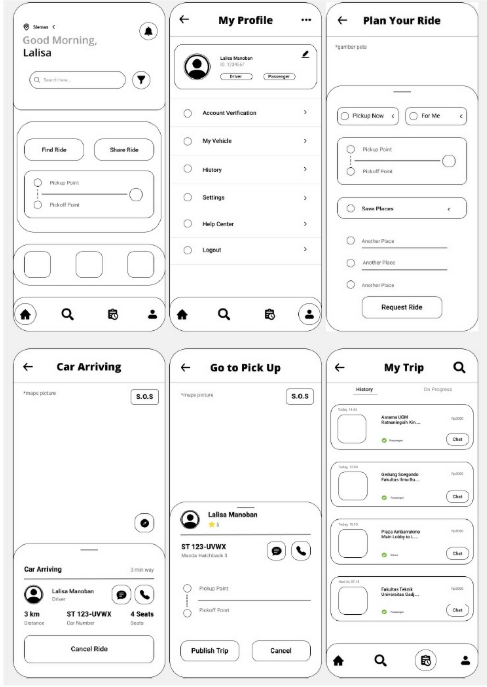

# Dokumentasi Proyek Lelaku

Dokumen ini menyimpan catatan workflow Git, rancangan UI/UX, palette warna,
component diagram, ERD, serta struktur data utama aplikasi Lelaku.

> Terakhir diperbarui: 21 September 2026

## 1. Workflow Branch, Pull Request, Review, dan Merge

### Struktur branch

~~~text
main
└── develop
    ├── feature/05-authentication
    ├── feature/06-profile-vehicle
    ├── fix/04-ci-config
    └── chore/04-repository-setup
~~~

### Aturan branch

- main digunakan sebagai branch stabil untuk rilis.
- develop digunakan sebagai branch integrasi pengembangan.
- Branch feature/*, fix/*, dan chore/* dibuat dari develop jika memungkinkan.
- Branch yang sudah terlanjur dibuat dari main tetap dapat digunakan. Tidak perlu
  dibuat ulang selama perubahan dan target integrasinya dicatat di pull request.
- Satu branch mengerjakan satu ruang lingkup perubahan agar pull request mudah
  diperiksa dan digabungkan.

### Alur pull request

Setiap branch memiliki pull request masing-masing menuju develop. Review dan
merge dilakukan secara mandiri oleh pemilik branch agar proses tetap cepat, dengan
catatan perubahan sudah diperiksa sendiri dan pemeriksaan otomatis berhasil.

| Branch | Basis yang disarankan | Target PR | PR dibuat | Review mandiri | CI/lint/type-check | Merge ke develop |
| --- | --- | --- | --- | --- | --- | --- |
| feature/05-authentication | develop | develop | [ ] | [ ] | [ ] | [ ] |
| feature/06-profile-vehicle | develop | develop | [ ] | [ ] | [ ] | [ ] |
| fix/04-ci-config | develop | develop | [ ] | [ ] | [ ] | [ ] |
| chore/04-repository-setup | develop | develop | [ ] | [ ] | [ ] | [ ] |

Sebelum merge, pemilik branch mencatat hal-hal berikut pada pull request:

- ringkasan perubahan dan ruang lingkupnya;
- issue atau task yang terkait;
- hasil self-review terhadap diff;
- hasil lint, type-check, test, dan build jika relevan;
- catatan perubahan konfigurasi atau environment variable;
- screenshot untuk perubahan interface jika diperlukan.

Setelah seluruh perubahan yang dibutuhkan terintegrasi dan siap dirilis,
develop dapat digabungkan ke main.

## 2. Lo-fi Wireframe

Wireframe berikut menjadi referensi awal untuk halaman utama, profil, perencanaan
perjalanan, perjalanan yang sedang berlangsung, penjemputan, dan riwayat trip.

Halaman yang tergambar:

- Home dengan aksi Find Ride dan Share Ride;
- My Profile;
- Plan Your Ride;
- Car Arriving;
- Go to Pick Up;
- My Trip.

Wireframe ini bersifat low-fidelity, sehingga detail visual dan komponen dapat
disesuaikan saat implementasi high-fidelity tanpa mengubah alur utama pengguna.

## 3. Color Palette

Palette utama Lelaku menggunakan warna hijau lembut yang memberi kesan natural,
aman, dan nyaman.

| Warna | Hex | Penggunaan yang disarankan |
| --- | --- | --- |
| Hijau sangat terang | #E7F5DC | Background utama dan area kosong |
| Hijau tua | #728156 | Teks utama, tombol utama, dan aksen |
| Hijau muda | #CFE1B9 | Surface sekunder dan area informasi |
| Hijau olive | #88976C | Teks sekunder, icon, dan state aktif |
| Hijau pastel | #B6C99B | Card, border, dan divider |
| Hijau muted | #98A77C | Highlight, hover, dan aksen tambahan |

## 4. Component Diagram

Sistem Lelaku menggunakan Next.js sebagai front-end dan FastAPI sebagai
backend. Backend terdiri dari modul Auth & Identity, Trip Matching,
Chat & Rating, dan Risk Detection AI. Data disimpan menggunakan
PostgreSQL sebagai database utama, Redis untuk cache/data sementara, dan
Azure Blob Storage untuk penyimpanan file.

~~~mermaid
flowchart LR
    USER["Pengguna"] --> FRONTEND["Next.js Front-end"]
    FRONTEND --> BACKEND["FastAPI Backend"]

    subgraph MODULES["Modul Backend"]
        AUTH["Auth & Identity"]
        MATCH["Trip Matching"]
        CHAT["Chat & Rating"]
        RISK["Risk Detection AI"]
    end

    BACKEND --> AUTH
    BACKEND --> MATCH
    BACKEND --> CHAT
    BACKEND --> RISK

    subgraph STORAGE["Data & Storage"]
        POSTGRES["PostgreSQL Database utama"]
        REDIS["Redis Cache / data sementara"]
        AZURE["Azure Blob Storage Penyimpanan file"]
    end

    AUTH --> POSTGRES
    AUTH --> AZURE
    MATCH --> POSTGRES
    MATCH --> REDIS
    CHAT --> POSTGRES
    RISK --> POSTGRES
    RISK --> REDIS
~~~

## 5. Entity Relationship Diagram (ERD)

ERD Lelaku terdiri dari beberapa entitas utama:

- User — menyimpan data pengguna.
- User Session — menyimpan metadata session login server-side.
- Driver Profile — menyimpan data dan verifikasi driver.
- Vehicle — menyimpan data kendaraan driver.
- Trip — menyimpan informasi perjalanan.
- Ride Request — menyimpan permintaan pengguna untuk bergabung ke perjalanan.
- Trip Member — mencatat pengguna yang tergabung dalam perjalanan.
- Trip Match — menyimpan hasil pencocokan perjalanan.
- Message — menyimpan percakapan dalam perjalanan.
- Rating — menyimpan penilaian antar pengguna setelah perjalanan.

Secara umum, User menjadi entitas utama yang terhubung dengan aktivitas
perjalanan, baik sebagai driver maupun penumpang.

~~~mermaid
erDiagram
    USER ||--o| DRIVER_PROFILE : "memiliki"
    USER ||--o{ USER_SESSION : "memiliki session"
    DRIVER_PROFILE ||--o{ VEHICLE : "memiliki"
    DRIVER_PROFILE ||--o{ TRIP : "mengemudikan"
    VEHICLE ||--o{ TRIP : "digunakan"
    USER ||--o{ RIDE_REQUEST : "membuat"
    TRIP ||--o{ RIDE_REQUEST : "menerima"
    TRIP ||--o{ TRIP_MEMBER : "memiliki anggota"
    USER ||--o{ TRIP_MEMBER : "bergabung"
    RIDE_REQUEST ||--o| TRIP_MEMBER : "menjadi anggota"
    TRIP ||--o{ TRIP_MATCH : "trip sumber"
    TRIP ||--o{ TRIP_MATCH : "trip yang cocok"
    TRIP ||--o{ MESSAGE : "memiliki pesan"
    USER ||--o{ MESSAGE : "mengirim"
    TRIP ||--o{ RATING : "memiliki rating"
    USER ||--o{ RATING : "memberi rating"
    USER ||--o{ RATING : "menerima rating"

    USER {
        string user_id PK
        string name
        string email
        string phone
        string password_hash
        string profile_photo
        string identity_status
        decimal avg_rating
        int total_ratings
        int total_trips_completed
    }

    USER_SESSION {
        string session_token_hash PK
        string user_id FK
        datetime created_at
        datetime expires_at
        datetime revoked_at
    }

    DRIVER_PROFILE {
        string user_id PK
        string document_url
        string verification_status
        decimal avg_rating_driver
        int total_ratings_driver
        int total_trips_as_driver
    }

    VEHICLE {
        string vehicle_id PK
        string driver_id FK
        string type
        string brand
        string model
        string plate_number
        int capacity
    }

    TRIP {
        string trip_id PK
        string driver_id FK
        string vehicle_id FK
        string origin
        string destination
        datetime departure_time
        int available_seats
        string status
        decimal estimated_total_cost
        decimal cost_per_seat
    }

    RIDE_REQUEST {
        string request_id PK
        string requester_id FK
        string trip_id FK
        string pickup
        string status
        datetime created_at
    }

    TRIP_MEMBER {
        string trip_member_id PK
        string trip_id FK
        string user_id FK
        string ride_request_id FK
        string status
    }

    TRIP_MATCH {
        string match_id PK
        string trip_id FK
        string matched_trip_id FK
        decimal route_similarity
        decimal match_score
    }

    MESSAGE {
        string message_id PK
        string trip_id FK
        string sender_id FK
        string content
        datetime send_at
    }

    RATING {
        string rating_id PK
        string trip_id FK
        string rater_id FK
        string rated_user_id FK
        string role_context
        int score
    }
~~~

### Kamus data dan relasi

| Entitas | Primary Key (PK) | Foreign Key (FK) | Atribut lain |
| --- | --- | --- | --- |
| User | user_id | - | name, email, phone, password_hash, profile_photo, identity_status, avg_rating, total_ratings, total_trips_completed |
| User_session | session_token_hash | user_id → User | created_at, expires_at, revoked_at |
| Driver_profile | user_id | user_id → User | document_url, verification_status, avg_rating_driver, total_ratings_driver, total_trips_as_driver |
| Vehicle | vehicle_id | driver_id → Driver_profile | type, brand, model, plate_number, capacity |
| Trip | trip_id | driver_id → Driver_profile, vehicle_id → Vehicle | origin, destination, departure_time, available_seats, status, estimated_total_cost, cost_per_seat |
| RideRequest | request_id | requester_id → User, trip_id → Trip | pickup, status, created_at |
| TripMember | trip_member_id | trip_id → Trip, user_id → User, ride_request_id → RideRequest | status |
| TripMatch | match_id | trip_id → Trip, matched_trip_id → Trip | route_similarity, match_score |
| Message | message_id | trip_id → Trip, sender_id → User | content, send_at |
| Rating | rating_id | trip_id → Trip, rater_id → User, rated_user_id → User | role_context, score |

Relasi utama antarentitas adalah:

- User–Driver_profile (1:0..1)
- User–User_session (1:N)
- Driver_profile–Vehicle (1:N)
- Driver_profile–Trip (1:N)
- Vehicle–Trip (1:N)
- User–RideRequest (1:N)
- Trip–RideRequest (1:N)
- Trip–TripMember (1:N)
- User–TripMember (1:N)
- Trip–Message (1:N)
- User–Message (1:N)
- Trip–Rating (1:N)
- User–Rating (1:N) sebagai pemberi maupun penerima rating

TripMatch memiliki relasi ke Trip untuk menyimpan pasangan perjalanan yang
memiliki kecocokan.

### Catatan LL-05: status identitas

Untuk LL-05, Bayu menyetujui penambahan `USER.identity_status` dengan nilai
`verified` atau `unverified`; nilai awal user baru adalah `unverified`.
Implementasi fisik PostgreSQL menggunakan tabel `users` untuk entitas `USER`.

`DRIVER_PROFILE.verification_status` tetap dipertahankan khusus untuk status
verifikasi driver dan tidak digunakan sebagai status identitas umum pengguna.
LL-05 juga menggunakan entitas `USER_SESSION` yang disetujui untuk session
server-side. Database hanya menyimpan digest SHA-256 dari token opaque, bukan
nilai cookie mentah. Rincian kontrak auth/profile/session ada di
[`auth-profile-contract.md`](auth-profile-contract.md).

## 6. Pemeliharaan Dokumentasi

Dokumen ini perlu diperbarui ketika:

- ada branch baru atau perubahan nama branch;
- pull request dibuat, direview, atau di-merge;
- wireframe atau palette berubah;
- modul backend, storage, atau relasi data berubah;
- atribut tabel ditambahkan, dihapus, atau diubah.
